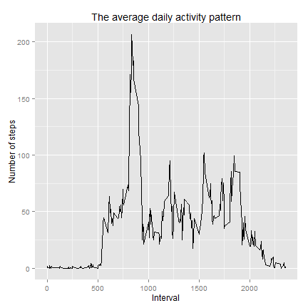
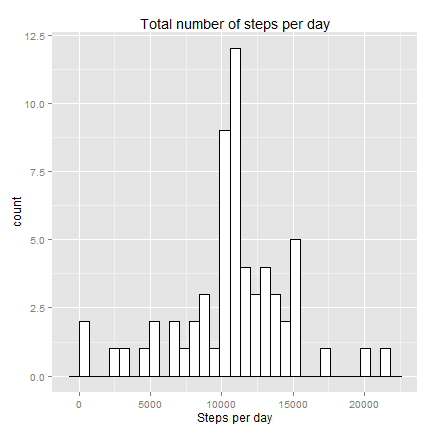
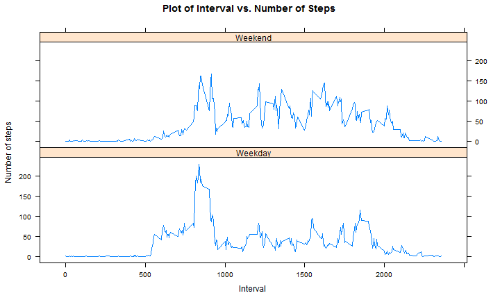

Analyze data collected from a personal activity monitoring device.
========================================================

This document is written using R Markdown. 

#Global setup options for knitr


```r
setwd("~/Coursera")

require(knitr)
opts_chunk$set(message=FALSE, fig.width = 6, fig.height = 6)
```

#Load other required packages


```r
require(plyr)
```

```
## Warning: package 'plyr' was built under R version 3.1.1
```

```r
require(ggplot2)
```

```
## Warning: package 'ggplot2' was built under R version 3.1.1
```

```r
require(lattice)
```


##Step 1 - Load the dataset and preprocess if necessary


```r
  activity = read.csv(file = "C:\\Users\\Arun\\Documents\\Coursera\\repdata-data-activity\\activity.csv", header = TRUE)

#Makes sure date field contains date by transforming string to date format
activity <- transform(activity, date = as.Date(date))

#head(df) 
#summary(df)
```

##Step 2 - Mean of total number of steps taken per day
This will be total number of steps divided by total days


```r
##Summarize the total steps by the date
stepsPerDay <- ddply(activity, ~date, summarise, steps = sum(steps))
#head(stepsPerDay)
```


###Step 2a - Plot a histogram of the total number of steps taken per day.

```r
p <- ggplot(stepsPerDay, aes(steps))
p <- p + geom_histogram(fill = "white", color = "black")
p <- p + ggtitle("Total number of steps per day")
p + xlab("Steps per day")
```

 

###Step 2b - Compute the `mean` and `median` of the total number of steps taken per day.

```r
meanStepsPerDay <- mean(stepsPerDay$steps, na.rm = TRUE)
medianStepsPerDay <- median(stepsPerDay$steps, na.rm = TRUE)
```

- The mean of total number of steps per day is 10766
- The median of total number of steps per day is 10765

##Step 3 - Average daily activity pattern

Average number of steps by interval

```r
avgStepsPerInterval <- ddply(activity,
                             ~interval, 
                             summarise,
                             mean = mean(steps, na.rm = T))
```

###Step 3a - Make a time series plot of the 5-minute interval and the average number of steps taken  and averaged across all days.

```r
p <- ggplot(avgStepsPerInterval, aes(interval, mean)) + geom_line()
p <- p + ggtitle("The average daily activity pattern")
p + xlab("Interval") + ylab("Number of steps")
```

 

###Step 3b - Which 5-minute interval, on average across all the days in the dataset, contains the maximum number of steps?

```r
maxId <- which.max(avgStepsPerInterval$mean)
maxInterval <- avgStepsPerInterval$interval[maxId]
```

- The 5-minute interval, on average across all days, that contains the maximum number of steps is 835


##Step 4 - Imputing missing values

###Step 4a - Calculate the total number of missing values in the dataset - Total NA's

```r
numberRowNAs <- sum(apply(is.na(activity), 1, any))
```

- The total number of missing values in the dataset is 2304

###Step 4b - Devise a strategy for filling in all of the missing values in the dataset. The strategy does not need to be sophisticate. For example, you could use the mean/median for that day, or the mean for that 5-minute interval, etc

Create a function replacing the NA's step by the mean of 5-minute interval averaged across all days.

```r
na.replace <- function(act) {
    ddply(act, ~interval, function(dd) {
        steps <- dd$steps
        dd$steps[is.na(steps)] <- mean(steps, na.rm = TRUE)
        return(dd)
    })
}
```

Create a new dataset that is equal to the original dataset but with the missing data filled in.

```r
imputedActivity <- na.replace(activity)
```

Find the total number of steps taken by each day.

```r
imputedStepsPerDay <- ddply(imputedActivity, ~date, summarise, steps = sum(steps))
```

Make a histogram of the total number of steps taken each day.

```r
p <- ggplot(imputedStepsPerDay, aes(steps))
p <- p + geom_histogram(fill = "white", color = "black")
p <- p + ggtitle("Total number of steps per day")
p + xlab("Steps per day")
```

 

Calculate `mean` and `median` total number of steps taken per day.

```r
imputedMeanStepsPerDay <- mean(imputedStepsPerDay$steps)
imputedMedianStepsPerDay <- median(imputedStepsPerDay$steps)
```

- The mean of total number steps per day is 
10766
- The median of total number steps per day is 
10766

The imputation slightly impacted on the median total number of steps taken per day. It was changed from 10765 to 10766. The mean total number of steps taken per day remained the same. Usually the imputing of missing values can introduce bias in an estimates but in our case impact of it on the estimates of the total daily number of steps is negligible.

## Step 5 - Are there differences in activity patterns between weekdays and weekends?

### Step 5a - Create a new factor variable `weekpart` in the dataset with two levels "weekday" and "weekend".

```r
weekParts <- c("Weekday", "Weekend")
date2weekpart <- function(date) {
    day <- weekdays(date)
    part <- factor("Weekday", weekParts)
    if (day %in% c("Saturday", "Sunday"))
        part <- factor("Weekend", weekParts)
    return(part)
}

imputedActivity$weekpart <- sapply(imputedActivity$date, date2weekpart)
```

### Step 5b - Make a panel plot containing a time series plot of the 5-minute interval and the average number of steps taken, averaged across all weekday days or weekend days.

```r
avgSteps <- ddply(imputedActivity,
                  .(interval, weekpart),
                  summarise,
                  #mean = mean(steps))
                  steps = mean(steps))

#p <- ggplot(avgSteps, aes(x = interval, y = mean))
#p <- p + geom_line() + facet_grid(. ~ weekpart, )
#p <- p + ggtitle("Activity patterns on weekends and weekdays")
#p + xlab("Interval") + ylab("Number of steps")


#Lattice plot

xyplot((steps) ~ interval | weekpart, main = "Plot of Interval vs. Number of Steps", data = avgSteps, type = "l", xlab = "Interval",  ylab = "Number of steps", layout=c(1,2))
```

 

